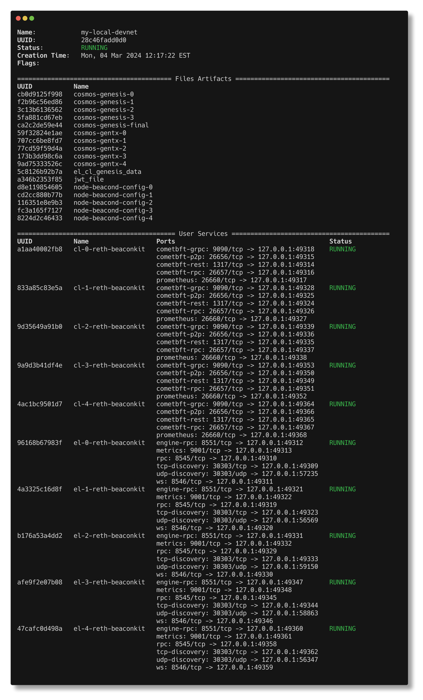

# Running BeaconKit with Kurtosis

## What is Kurtosis?

[Kurtosis](https://www.kurtosis.com/) is a platform for running distributed systems on Docker / Kubernetes. It provides a simple, powerful framework for spinning up and tearing down distributed systems programmatically.

## How to Use

To use BeaconKit with Kurtosis, you'll first need to install the Kurtosis CLI and its dependencies. You can find instructions for doing so [here](https://docs.kurtosis.com/install).

Once you've installed the Kurtosis CLI, you can use it to spin up a Beacon network with the following command from within the root directory of the beacon-kit repo:

```bash
make start-devnet
```

This will automatically build your beacond docker image from the local source code, and spin up a Kurtosis network based on the config file in `kurtosis/beaconkit-all.yaml`. Once complete, this will output all the network information for your nodes like so:



When you want to tear down your network, you can do so with the following commands:

```bash
make stop-devnet
make rm-devnet
```

And that's it!